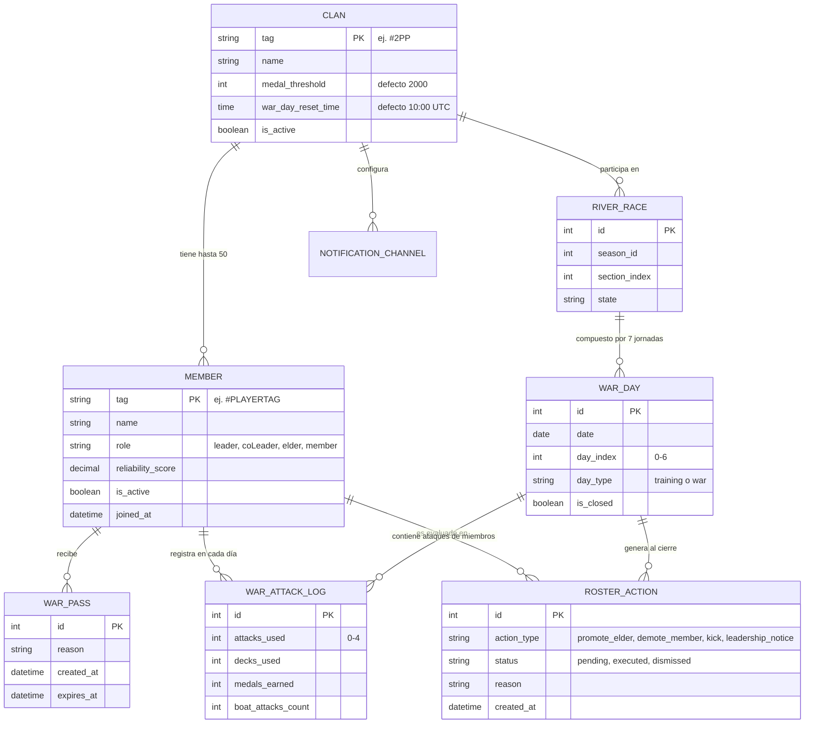

# Plan de Arquitectura e Implementación - Fase 1: Backend Core

Este documento especifica la arquitectura técnica consensuada y el plan de implementación paso a paso para la **Fase 1** del proyecto **Clan War Management**.

---

## 1. Resumen de Decisiones de Diseño

| Componente | Decisión Consensuada | Justificación |
|---|---|---|
| **Estructura de Repositorio** | Monorepo (`backend/`, `frontend/`, `docs/`) | Desacoplamiento limpio entre API y UI web manteniendo un solo repositorio y orquestación unificada. |
| **Orquestación Local** | `docker-compose.yml` (PostgreSQL 16, Redis 7, Django, Celery Worker, Celery Beat) | Entorno reproducible y paridad de producción sin dependencias externas en host. |
| **Gestor de Paquetes** | `uv` con `pyproject.toml` | Instalación ultrarrápida, gestión nativa de lockfiles y resolución determinista. |
| **Framework Backend** | Django 5 + Django REST Framework + SimpleJWT | Robusto ORM, Django Admin listo para auditoría y API REST desacoplada para el frontend. |
| **Apps de Dominio** | 5 apps modulares: `clans`, `wars`, `governance`, `ingestion`, `notifications` | Separación estricta de responsabilidades según DDD y el lenguaje ubicuo ([`CONTEXT.md`](../CONTEXT.md)). |
| **API Client Clash Royale** | Cliente propio con `httpx` (backoff exponencial, reintentos, control de rate limiting) | Integración directa con los endpoints de River Race de Supercell y soporte de mock fixtures para testing. |
| **Ingesta de Datos** | Híbrida: Celery Beat periódico + endpoints de disparo bajo demanda | Monitoreo automatizado en días de guerra y capacidad de refresco manual instantáneo. |
| **Gobernanza y Roster** | Ciclo de vida auditable: `PENDING` $\rightarrow$ `EXECUTED` / `DISMISSED` | La API de Clash Royale es de solo lectura; los líderes confirman la ejecución en el juego. |
| **Adaptadores de Notificación** | Patrón Adapter desacoplado (Discord, Telegram, Console/Log) | Eventos de dominio neutrales formateados según plataforma ([`ADR 0003`](adr/0003-multi-provider-notifications-and-bot.md)). |
| **Reinicio de Guerra** | 10:00 UTC por defecto, configurable por Clan | Alineado con el horario oficial de Supercell para River Race. |

---

## 2. Arquitectura de Dominio y Datos

---

## 3. Plan de Implementación por Etapas

### Etapa 1: Estructura del Proyecto y Docker Compose
1. Crear el árbol de directorios monorepo:
   - `backend/`
   - `frontend/` (placeholder con README para fase posterior)
2. Configurar `docker-compose.yml` en la raíz con servicios:
   - `db`: PostgreSQL 16 con healthcheck.
   - `redis`: Redis 7 para Celery broker y caching.
   - `api`: Django backend (Gunicorn/runserver en dev).
   - `celery_worker`: Procesamiento asíncrono de ingesta y notificaciones.
   - `celery_beat`: Programador de tareas periódicas.
3. Inicializar `backend/pyproject.toml` usando `uv` con dependencias base:
   - Django, djangorestframework, djangorestframework-simplejwt, psycopg2-binary / psycopg, celery, redis, httpx, django-environ, ruff, pytest, pytest-django, respx.

### Etapa 2: Apps de Dominio y Modelos ORM
1. Crear apps en `backend/apps/`:
   - `clans`: `Clan`, `Member`, `WarPass`.
   - `wars`: `RiverRace`, `WarDay`, `WarAttackLog`.
   - `governance`: `RosterAction`, cálculo de `ReliabilityScore`.
   - `notifications`: `NotificationChannel`, `NotificationEvent`.
2. Registrar apps en `settings.py`, configurar migraciones iniciales y tests de modelos.
3. Registrar modelos en `Django Admin` con filtros, búsquedas y acciones personalizadas.

### Etapa 3: Cliente de API Clash Royale e Ingesta
1. Construir `ClashRoyaleClient` con `httpx`:
   - Manejo de autenticación Bearer (`API_KEY`).
   - Manejo de rate limits (HTTP 429), reintentos con jitter y backoff.
   - Normalización de tags (`#TAG` $\rightarrow$ `%23TAG`).
2. Servicios de sincronización en `apps/ingestion/services/`:
   - `SyncClanService`: sincroniza miembros y roles.
   - `SyncRiverRaceService`: sincroniza carrera actual, registros de ataques por día y conteo de ataques a barco.
3. Fixtures JSON de prueba y tests unitarios con `respx` y `pytest`.

### Etapa 4: Motor de Reglas de Gobernanza
1. Implementar `GovernanceEngineService` evaluador:
   - Comprueba ataques en días de guerra (jueves a domingo): si < 4 ataques, genera acción según rol (Líder/Colíder $\rightarrow$ `leadership_notice`; Veterano $\rightarrow$ `demote_member`; Miembro $\rightarrow$ `kick`).
   - Detecta si el miembro tiene un `WarPass` activo $\rightarrow$ exención documentada.
   - Detecta ataques a barco $\rightarrow$ marca `Boat Attack Infraction` y anula elegibilidad de ascenso.
   - Evalúa ascensos a Veterano al cierre de la carrera: 100% de ataques completados, $\ge$ umbral de medallas (2000 por defecto) y 0 ataques a barco $\rightarrow$ `promote_elder`.
2. Cálculo de `ReliabilityScore` histórico basado en asistencias de últimas semanas.
3. Batería exhaustiva de tests para cada regla y caso borde.

### Etapa 5: Adaptadores de Notificación
1. Crear interfaz base `NotificationAdapter`:
   - Métodos: `send_pending_attacks_alert()`, `send_daily_roster_report()`, `send_leadership_notice()`.
2. Implementar adaptadores:
   - `ConsoleNotificationAdapter`: para desarrollo local y tests.
   - `DiscordWebhookNotificationAdapter`: genera Embeds enriquecidos con colores temáticos según la gravedad de la acción.
   - `TelegramNotificationAdapter`: formatea mensajes en MarkdownV2 / HTML.

### Etapa 6: Tareas Celery y Endpoints REST (DRF)
1. Tareas Celery:
   - `task_sync_clan_data(clan_tag)`: ingesta periódica.
   - `task_evaluate_war_day_governance(clan_tag)`: cierre diario a las 10:00 UTC.
   - `task_send_pending_attack_reminders(clan_tag)`: avisos antes del reinicio diario.
2. Endpoints DRF (JWT + Session):
   - `/api/clans/`: listar y configurar clanes.
   - `/api/clans/{tag}/members/`: lista de miembros con score y ataques pendientes.
   - `/api/clans/{tag}/sync/`: trigger de ingesta manual on-demand.
   - `/api/roster-actions/`: listar y actualizar estado (`executed`, `dismissed`).
   - `/api/war-passes/`: otorgar y revocar pases de exención.

---

## 4. Criterios de Aceptación de la Fase 1
- [ ] `docker compose up` levanta PostgreSQL, Redis, Django API y Celery sin errores.
- [ ] Migraciones aplicadas correctamente y panel de Django Admin funcional con el lenguaje ubicuo.
- [ ] El cliente de Clash Royale sincroniza exitosamente los datos de un clan real o mockeado.
- [ ] El motor de gobernanza genera las acciones de roster correctas para cada regla estipulada en [`ADR 0002`](adr/0002-clan-war-governance-rules.md).
- [ ] Los adaptadores de notificación despachan alertas a consola y a webhooks de prueba.
- [ ] La suite de pruebas de `pytest` corre en verde con alta cobertura en la lógica de dominio.
